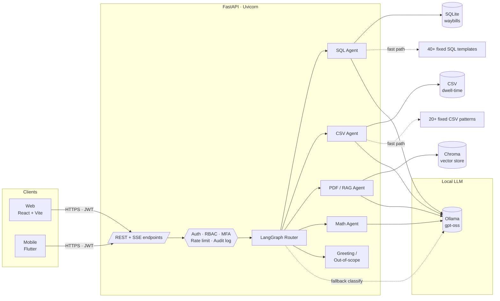
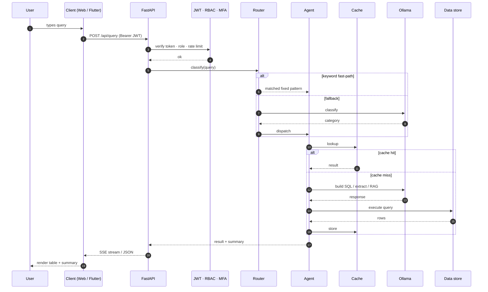

# Fleet Dispatch AI Assistant

> **Bilingual (English/Arabic, RTL-aware) production AI assistant that lets dispatch operators query operational data in natural language.**

Operators need answers to questions like *"which vendor has the most overdue waybills this week?"* or *"what does the regulatory grid code say about dispatch under load shedding?"* — across structured databases, CSV exports, and regulatory PDFs, in either Arabic or English, on web or mobile.

This repository is a **portfolio / showcase version** of a real production system I built. Customer-specific data, branding, internal hostnames, and credentials have been removed. All commits, architecture, and security implementations are preserved as-built.

## What it does

Routes a natural-language question to one of four specialised agents — SQL, CSV, PDF/RAG, or math — and returns an answer with sub-second latency on common queries.

## Stack

- **Backend:** Python + FastAPI, LangGraph multi-agent orchestration, local Ollama LLM
- **Router:** Hybrid keyword-plus-LLM router — short-circuits common queries to skip the LLM call entirely
- **Frontend (web):** React + SSE streaming
- **Frontend (mobile):** Flutter for Android + iOS, RTL-aware Arabic layout
- **Data:** SQLite + CSV + PDF document store

## Security stack (designed and built solo)

- JWT with refresh tokens
- RBAC across 5 roles
- TOTP-based MFA
- Per-user rate limiting + input validation
- Audit logging
- Server-side column encryption
- Scheduled data-retention job

## Why hybrid routing matters

Most multi-agent systems route every query through an LLM classifier. That's slow and expensive. The hybrid keyword-plus-LLM router catches the top 60% of common queries with regex-style intent detection, and falls back to the LLM only for ambiguous cases — sub-second responses, lower cost, deterministic behavior on the easy path.

---

## Architecture



A single user query enters the router, gets classified by keyword (fast path) or LLM (fallback), and is dispatched to the right agent. Each agent has its own caching layer and fallback templates. Results stream back via Server-Sent Events.

### Request flow



---

## Detailed dependencies

| Layer | Versions / libraries |
|-------|----------------------|
| **Backend** | Python 3.11, FastAPI, Uvicorn, LangChain, LangGraph, SQLite |
| **LLM** | Ollama (`gpt-oss`) — local inference, no external API calls |
| **Vector store** | ChromaDB (RAG over policy / reference PDFs) |
| **Web frontend** | React 19, TypeScript, Vite, Tailwind CSS |
| **Mobile** | Flutter 3, Dart, Riverpod, Dio, `flutter_secure_storage` |
| **Security** | PyJWT, PBKDF2-SHA256, PyOTP (TOTP / RFC 6238), `qrcode` |
| **Streaming** | Server-Sent Events (SSE) end-to-end |
| **i18n** | Flutter `intl` + ARB files (EN + AR with RTL) |

---

## Highlights worth a closer look

If you're reviewing this as a portfolio, these are the parts I'd point at:

- **`backend/langgraph_workflow.py`** — the multi-agent orchestration graph.
- **`backend/router.py`** — the keyword + LLM hybrid routing layer that keeps p95 latency low.
- **`backend/auth.py`, `backend/mfa.py`, `backend/rbac.py`** — the full security stack: JWT issue/verify, refresh tokens, TOTP setup/verify, role-based endpoint guards.
- **`backend/agents/sql_agent.py`** — LLM-generated SQL with parameterization, fixed-pattern fast paths, and timeout fallbacks.
- **`backend/encryption.py`** — column-level encryption for the server-side cache (POC-grade XOR + base64 with SHA-256–derived key).
- **`backend/data_retention.py`** — background thread for log/cache cleanup.
- **`fleet_dispatch_app/lib/core/network/api_client.dart`** — Dio interceptor with automatic 401-driven refresh.
- **`fleet_dispatch_app/lib/screens/mfa_screen.dart`** — TOTP entry screen with auto-submit.
- **`SECURITY_ROADMAP.md`** — the planning doc that drove the security work; useful for understanding the *why* behind each control.

---

## Version history

| Version | Highlights |
|---------|------------|
| **1.2.0** | Corporate security: RBAC, token refresh, MFA (TOTP), data retention, column encryption |
| 1.1.0 | Security layer: JWT auth, input validation, rate limiting, audit logging |
| 1.0.1 | Performance: keyword router, template summaries, query caching, fixed queries |
| 1.0.0 | Initial release: LLM SQL agent, chat UI, Flutter mobile app |

---

## Quick start

### Prerequisites

| Requirement | Version | Purpose |
|-------------|---------|---------|
| Python | 3.11+ | Backend API server |
| Node.js | 18+ | Frontend build (dev only) |
| Ollama | latest | Local LLM inference |
| Flutter | 3.x | Mobile app build (optional) |

### Run locally

```bash
# 1. Pull the local LLM
ollama pull gpt-oss

# 2. Install backend deps
pip install -r backend/requirements.txt

# 3. Install web frontend deps
npm install

# 4. Start everything
ollama serve                                                          # terminal 1
uvicorn backend.main:app --reload --host 0.0.0.0 --port 8000          # terminal 2
npm run dev                                                           # terminal 3
```

| Service | URL |
|---------|-----|
| Backend API | http://localhost:8000 |
| Web (dev) | http://localhost:5173 |
| Swagger | http://localhost:8000/docs |

### Build the mobile app

```bash
cd fleet_dispatch_app
flutter pub get
flutter build apk --release --dart-define=ENV=local
# APK at: build/app/outputs/flutter-apk/app-release.apk
```

---

## Sample queries

```
How many waybills are there today?
Show contractor-wise summary for last month
What is the status of waybill 2-25-0010405?
List vehicles with dwell time over 6 hours
Monthly fuel consumption summary
Show today's dispatch details
```

The system routes each query to the right agent automatically; the user never has to know which one answered.

---

## RBAC matrix

| Role | SQL | CSV | PDF | Math | Greeting |
|------|:---:|:---:|:---:|:----:|:--------:|
| admin | yes | yes | yes | yes | yes |
| operations | yes | yes | — | yes | yes |
| finance | yes | — | — | yes | yes |
| user | yes | yes | — | yes | yes |
| viewer | — | — | — | — | yes |

Permissions are enforced at the FastAPI dependency layer; every protected endpoint runs through `require_role(...)`.

---

## API overview

### Auth
| Endpoint | Method | Description |
|----------|--------|-------------|
| `/api/login` | POST | Username/password login → JWT + refresh token |
| `/api/token/refresh` | POST | Exchange refresh token for new access token |
| `/api/mfa/login` | POST | Complete MFA login with 6-digit TOTP |

### MFA management
| Endpoint | Method | Description |
|----------|--------|-------------|
| `/api/mfa/status` | POST | Is MFA enabled for current user? |
| `/api/mfa/setup` | POST | Generate TOTP secret + QR code |
| `/api/mfa/verify` | POST | Verify TOTP code to enable MFA |
| `/api/mfa/disable` | POST | Disable MFA (password + TOTP required) |

### Queries
| Endpoint | Method | Description |
|----------|--------|-------------|
| `/api/query` | POST | Process natural-language query |
| `/api/query/stream` | POST | SSE streaming response |
| `/api/route` | POST | Classify query → category, no execute |
| `/api/results/{id}` | GET | Paginated cached results |

### Admin & meta
| Endpoint | Method | Description |
|----------|--------|-------------|
| `/api/categories` | GET | List query categories |
| `/api/categories/{id}/queries` | GET | Sample queries per category |
| `/api/usage-stats` | GET | Usage statistics |
| `/api/admin/cleanup` | POST | Manual data-retention sweep |

---

## Project layout

```
chatbot_mobileapp/
├── backend/                       # FastAPI service
│   ├── main.py                    # All API endpoints
│   ├── auth.py                    # JWT (access/refresh/MFA tokens)
│   ├── mfa.py                     # TOTP (pyotp + QR)
│   ├── rbac.py                    # Role-based access control
│   ├── encryption.py              # Column encryption
│   ├── data_retention.py          # Scheduled cleanup
│   ├── audit_log.py               # Request audit middleware
│   ├── rate_limiter.py            # Per-user throttling
│   ├── input_validator.py         # SQL-injection / length checks
│   ├── router.py                  # Keyword + LLM hybrid routing
│   ├── langgraph_workflow.py      # Multi-agent orchestration
│   ├── agents/                    # SQL, CSV, PDF, math agents
│   ├── pdf_agent/                 # RAG over reference PDFs (Chroma)
│   ├── fixed_queries.py           # 40+ fast-path SQL templates
│   ├── fixed_csv_queries.py       # 20+ fast-path CSV patterns
│   └── requirements.txt
├── components/                    # React UI components
│   ├── ChatWidget.tsx             # Streaming chat interface
│   ├── MfaSetup.tsx               # MFA enable/disable modal
│   └── ...
├── fleet_dispatch_app/            # Flutter Android + iOS app
│   ├── lib/
│   │   ├── core/network/          # Dio + auto-refresh interceptor
│   │   ├── services/              # auth, chat, session, stats, cache
│   │   ├── providers/             # Riverpod state
│   │   ├── screens/               # login, MFA, chat, settings, stats
│   │   └── l10n/                  # EN + AR ARB files
│   └── test/                      # 20+ unit/widget tests
├── App.tsx · apiClient.ts         # Web entry + auth-aware fetch wrapper
├── SECURITY_ROADMAP.md            # Security planning + tracker
├── BASELINE_BENCHMARK.md          # Performance baselines
└── OPTIMIZATION_LOG.md            # Optimization decisions log
```

---

## Environment variables

| Variable | Purpose |
|----------|---------|
| `JWT_SECRET` | JWT signing secret — **must set in production** |
| `DATA_ENCRYPTION_KEY` | Column-encryption key — **must set in production** |
| `CORS_ORIGINS` | Allowed origins (comma-separated); defaults to `*` for local dev |
| `VITE_API_URL` | Frontend API base URL override |

---

## What's *not* in this repo (and why)

This is a sanitized portfolio copy. The following were intentionally excluded from the public version:

- The customer's real waybill / vehicle / vendor datasets (SQLite + CSV)
- Reference PDFs covered by RAG (industry-specific regulatory docs)
- Deployment artifacts tied to the customer's infrastructure (nginx config, systemd unit, internal IP addresses)
- Branding assets and the customer's domain names
- E2E test screenshots that contained real operational data

The full git history (5 commits, 3 tagged releases) is preserved.

---

## License

[MIT](LICENSE) — free to learn from, fork, or build on with attribution.

---

**Author:** Santosh Achanta — [github.com/santosha86](https://github.com/santosha86)
